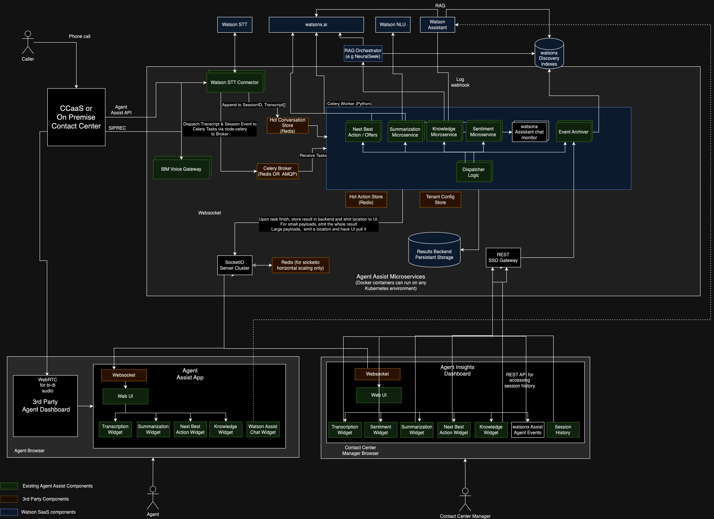
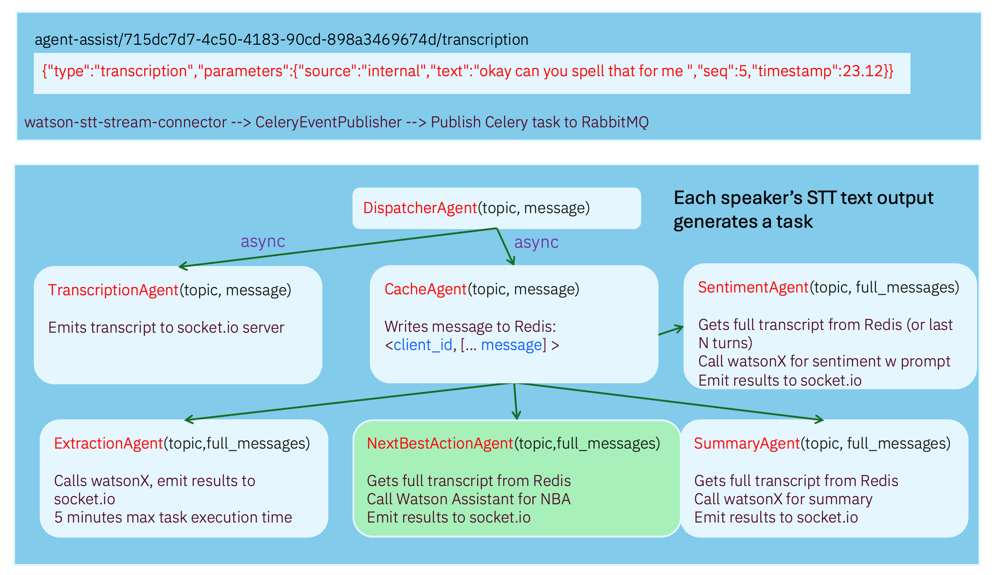

# Agent Assist

## Overview
Agent Assist is an asset to support the Active Listening Agent Assist usecase. Active Listening leverages watsonx.ai to provide functionality like Next Best Action, Call Sentiment, and Call Summarization to support human agents in real time to rapidly resolve caller issues. This asset provides a suite of microservices deployed as docker containers that orchestrate between a telephony provider like Genesys and IBM SaaS software including watsonx.ai, watsonx Assistant, Watson Discovery, Speech to Text, and IBM Voice Gateway.

## Installation

These instructions assume that you are using (rancher desktop)[https://rancherdesktop.io/] (which supports docker compose).

1. git clone
2. `cp .env_example .env`
3. Edit the env file and fill in credentials under the required sections
4. install [Tilt CLI](https://tilt.dev/) using brew `brew install tilt`
6. run `tilt up`
7. Open the console by pressing space
8. Navigate to http://localhost:3003
9. Supply sample audio file in the top right corner (a sample audio file can be found under ./test/call-samples)

## Call Sample Files
This repository provides a Watson STT Stream connector that simulates a Genesys CCaaS adapter (Call Center as a Service). Call sample files can be created by the mono-to-stereo-wav-converter inside ./utilities. Sample files will be provided soon!

## Using Without Tilt CLI

For docker compose:
```sh
docker-compose -f docker-compose.yml -f docker-compose.telemetry.yml -f docker-compose.ui.yml --env-file .env up
```

For podman compose:
```sh
podman compose -f docker-compose.yml -f docker-compose.telemetry.yml -f docker-compose.ui.yml --env-file .env up
```

## Localhost Ports

| Service          | Description          | Port(s) |
|------------------|----------------------|---------|
| API-Server       | Socketio Admin       | 8000    |
| wrapper-ui       | AA Demo UI                | 3003 (docker-compose), 5173 (dev mode)    |
| agent-dashboard-ui       | Agent iframe                | 3000 (docker-compose)   |
| stream connector | genesys              | 8080    |
| celery           | worker               | No ports|
| celery flower    | celery admin UI      | 5555    |
| jaeger           | Jaeger OTEL UI       | 16686   |

## Architecture



### Celery/RabbitMQ/Redis

[Python Celery](https://docs.celeryq.dev/en/stable/getting-started/first-steps-with-celery.html) is a distributed task queue system that sequences longer-running async tasks (like calling LLMs). Each turn of the agent/customer conversation (decoded by Watson STT) produces an Event which is packaged as a Celery Task (dispatcher task). It queues up a sequence of tasks to be executed. The tasks can land across different pods in the Celery cluster.



This Agent Assist solution uses RabbitMQ as the Celery Transport, and Redis as the Results backend.

### Socket.IO

[Socket.io](https://socket.io/docs/v4/tutorial/introduction) is used for real-time communication between the Agent's web UI (agent-dashboard-ui) to the api-server (which contains a socket.io server). When each Celery task finishes, it typically has a step in which it emits a socket.io message to the server. Each agent is effectively inside a socket.io chatroom, and the Celery tasks emit messages into the chatroom (joined only by the agent) so that messages can be isolated to a per-agent basis.

For bi-directional communication between 

## Contributors

- [Brian Pulito](https://github.com/bpulito)
- Kyle Sava
- [Bob Fang](https://github.com/bobfang)
- Keith Frost

